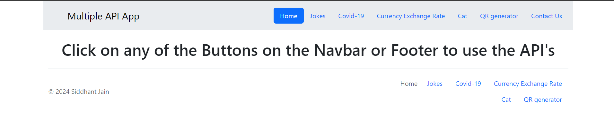

# Capstone-Project-4

## Multi API App

Introducing Multi API App, your versatile tool for both utility and entertainment! Create custom QR codes effortlessly, get your daily dose of laughter with random funny cat images, stay updated with the latest COVID-19 statistics including cases, tests, and deaths, check real-time currency exchange rates, and enjoy a variety of jokes to brighten your day. Multi API App brings together essential features and fun in one convenient package!
## To install Run the command

``` git clone https://github.com/sidjain1387/Capstone-Project-4-Multi-API.git```

## To Run the project

```
cd "Capstone-Project-4-Multi-API"
npm i
npm audit fix
nodemon index.js
```
## To See the website
```
Open The Browser
Type Localhost:3000

```
## To Stop the code

```Press Ctrl + C on your Terminal```

## And then you Will land on this page

